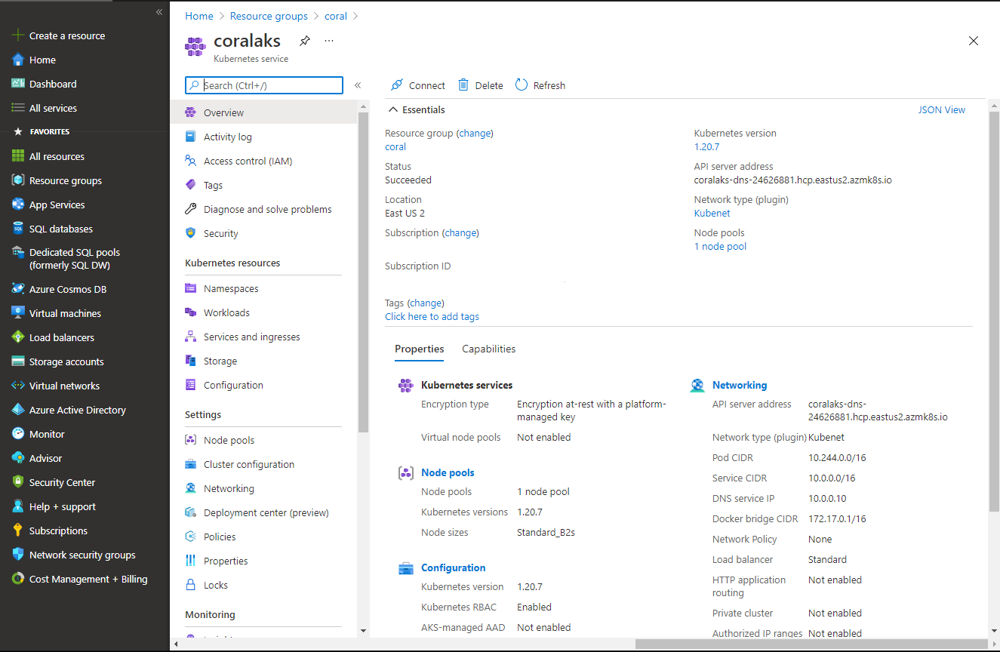

# Deploying Microservices to Azure Kubernetes Services

## Introduction ##

 

This article is the third part of series covering planning, solutioning, designing, developing, deploying and protecting Microservices deployed to Azure Kubernetes Services -

 

- [Planning and  Solutioning Microservices using Domain Driven Design](https://github.com/AmanpreetSingh-GitHub/Planning-and-Solutioning-Microservices-using-Domain-Driven-Design)
- [Developing Microservices using .Net 5](https://github.com/AmanpreetSingh-GitHub/Developing-Microservices-using-.Net-5)
- Deploying-Microservices to Azure Kubernetes Services
- Inter Microservices communication using Azure Service Bus
- Using Redis cache to increase performance during inter Microservices communicaiton
- Protecting Microservices inside Azure Kubernetes Services using Azure API Management
- Authenticate Microservices inside Azure Kubernetes Services using Azure Active Directory

 

This article covers following things –

- Add Dockerfile to our Employee Microservice project for creating Docker image
- Create Azure Container Registry that will be used to store Docker images of our Microservices
- Create Azure DevOps pipeline connecting GitHub code and deploying the Docker images in Azure Container Registry
- Setup Kubernetes environment using Azure Kubernetes Services where we will deploy our Microservices
- Create Ingress Controller that acts as all-in-one Load Balancer, Cache, API Gateway, and WAF for our Kubernetes environment
- Create Workloads in AKS
- Create Services to access our Workloads
- Create Ingress routes that our Ingress Controller will use to access the Services
- Add another MasterData Microservice using similar steps as Employee Microservice

 

## Add Dockerfile to Employee project ##

 

- Add Docker support to Coral.Employee.Api project and select Linux as Target OS

    
    

 

- Below is the code for Dockerfile

	>		#See https://aka.ms/containerfastmode to understand how Visual Studio uses this Dockerfile to build your images for faster debugging.
	>		
	>		FROM mcr.microsoft.com/dotnet/aspnet:5.0 AS base
	>		WORKDIR /app
	>		EXPOSE 80
	>		EXPOSE 443
	>		
	>		FROM mcr.microsoft.com/dotnet/sdk:5.0 AS build
	>		WORKDIR /src
	>		COPY ["Employee/Coral.Employee.Api/Coral.Employee.Api.csproj", "Employee/Coral.Employee.Api/"]
	>		COPY ["Employee/Coral.Employee.Service/Coral.Employee.Service.csproj", "Employee/Coral.Employee.Service/"]
	>		COPY ["Employee/Coral.Employee.Broker/Coral.Employee.Broker.csproj", "Employee/Coral.Employee.Broker/"]
	>		COPY ["Employee/Coral.Employee.Persistance/Coral.Employee.Persistance.csproj", "Employee/Coral.Employee.Persistance/"]
	>		COPY ["Infrastructure/Coral.Infrastructure.CrossCutting/Coral.Infrastructure.CrossCutting.csproj", "Infrastructure/Coral.Infrastructure.CrossCutting/"]
	>		COPY ["Employee/Coral.Employee.Domain/Coral.Employee.Domain.csproj", "Employee/Coral.Employee.Domain/"]
	>		RUN dotnet restore "Employee/Coral.Employee.Api/Coral.Employee.Api.csproj"
	>		COPY . .
	>		WORKDIR "/src/Employee/Coral.Employee.Api"
	>		RUN dotnet build "Coral.Employee.Api.csproj" -c Release -o /app/build
	>		
	>		FROM build AS publish
	>		RUN dotnet publish "Coral.Employee.Api.csproj" -c Release -o /app/publish
	>		
	>		FROM base AS final
	>		WORKDIR /app
	>		COPY --from=publish /app/publish .
	>		ENTRYPOINT ["dotnet", "Coral.Employee.Api.dll"]

 

## Create Azure Container Registry that will be used to store Docker images of our Microservices ##

 

- Provision Azure Container Registry where we will store Docker images of Employee and other Microservices

    

 

- Below are the basic settings for our ACR

    

 

- Below is our ACR 'coralregistry' that we provisioned

    

 

## Create Azure DevOps pipeline connecting GitHub code and deploying the Docker images in Azure Container Registry ##

 

- Create project 'Coral' in Azure DevOps

    

 

- Create pipeline in Azure DevOps to deploy Docker image of Employee Microservice to Azure Container Registry

     

    - Create new service connection to Azure from Azure DevOps

        
        
        

     

    - Create the pipeline for Employee Microservice
    
        

     

    - Choose Classic Editor for our pipeline

        
    
     

    - Connect to the GitHub repo

        
    
     

    - Select Docker template

        
    
     

    - Below are the options for pipeline

        
        
        
    
     

    - Add another build step to copy files for building Docker image

        
        

     

    - Specify settings for Build step

        
    
     

    - Specify settings for Publish step

        
    
     

    - Save the pipeline

        

 

- Run the pipeline that will deploy Docker image of Employee service to coralregistry ACR

    
    
    

 

## Setup Kubernetes environment using Azure Kubernetes Services ##

 

- Provision a new Kubernetes cluster where we will deploy our Microservices

    

 

- Choose basic settings for our cluster 'coralaks'

        
    
    
    
    
    
    

 

## Create Ingress Controller that acts as all-in-one Load Balancer, Cache, API Gateway, and WAF for our Kubernetes environment ##

 

- We will use Helm to install nginx-ingress

- Create a new namespace 'development' in Kubernetes cluster

    

 

- Add the ingress-nginx repository and use Helm to deploy an NGINX ingress controller

    
    

 

- Below is the full script for installing Ingress Contoller

	>		az aks get-credentials --resource-group coral --name coralaks
	>		
	>		# Create a namespace for your ingress resources
	>		kubectl create namespace development
	>		
	>		# Add the ingress-nginx repository
	>		helm repo add ingress-nginx https://kubernetes.github.io/ingress-nginx
	>		
	>		# Use Helm to deploy an NGINX ingress controller
	>		helm install nginx-ingress ingress-nginx/ingress-nginx \
	>		    --namespace development \
	>		    --set controller.replicaCount=1 \
	>		    --set controller.nodeSelector."kubernetes\.io/os"=linux \
	>		    --set controller.admissionWebhooks.patch.nodeSelector."kubernetes\.io/os"=linux \
	>		    --set defaultBackend.nodeSelector."kubernetes\.io/os"=linux \

 

## Create Workloads in AKS ##

 

- Create new Deployment that will deploy Employee Microservice pod

    
        

 

- Below is the full code of deployment.yaml file

	>		apiVersion: apps/v1
	>		kind: Deployment
	>		metadata:
	>		  name: employeeservice-deployment  
	>		  namespace: development
	>		spec:
	>		  replicas: 1
	>		  selector:
	>		    matchLabels:
	>		      app: employeeservice-pod
	>		  template:
	>		    metadata:
	>		      labels:
	>		        app: employeeservice-pod
	>		    spec:
	>		      containers:
	>		      - name: employeeservice-container
	>		        image: coralregistry.azurecr.io/employeeservice:437
	>		        imagePullPolicy: Always
	>		        ports:
	>		        - containerPort: 80

 

## Create Services to access our Workloads ##

 

- Create a new Cluster IP service to access Employee Microsrevice pod

    
        

 

- Below is the full code of service.yaml file

	>		apiVersion: v1
	>		kind: Service
	>		metadata:
	>		  name: employeeservice-service  
	>		  namespace: development
	>		spec:
	>		  type: ClusterIP
	>		  ports:
	>		  - port: 80
	>		  selector:
	>		    app: employeeservice-pod

 

## Create Ingress routes that our Ingress Controller will use to access the Services,  ##

 

- Create new ingress route that will be used by Ingress Controller to access the Services

    
        

 

- Below is the full code of ingress.yaml file

	>		apiVersion: networking.k8s.io/beta1v1
	>		kind: Ingress
	>		metadata:
	>		  name: ingress-service
	>		  namespace: development
	>		  annotations:
	>		    kubernetes.io/ingress.class: nginx
	>		    nginx.ingress.kubernetes.io/ssl-redirect: "false"
	>		    nginx.ingress.kubernetes.io/use-regex: "true"
	>		    nginx.ingress.kubernetes.io/rewrite-target: /$2
	>		spec:
	>		  rules:
	>		  - http:
	>		      paths:
	>		      - path: /demo(/|$)(.*)
	>		        pathType: Prefix
	>		        backend:
	>		          serviceName: employeeservice-service
	>		          servicePort: 80

 

## Add another MasterData Microservice using similar steps as Employee Microservice ##

 

- Use the same approach to implement MasterData Microservice and deploy to AKS (code is uploaded to this GitHub repository)
